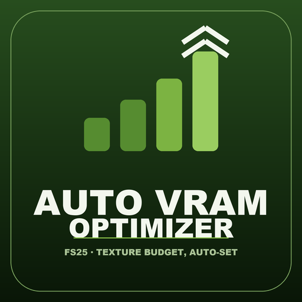
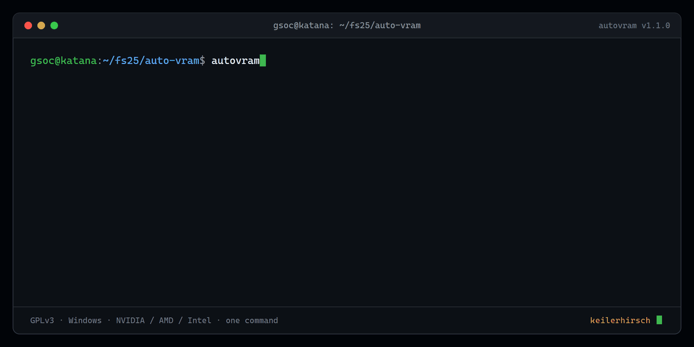

<div align="center">



# Auto VRAM Optimizer

**Raise Farming Simulator 25's texture-streaming VRAM budget — matched to your card, automatically.**

[](LICENSE) &nbsp;·&nbsp; FS25 &nbsp;·&nbsp; Multiplayer-safe &nbsp;·&nbsp; 8 languages

</div>

> [!IMPORTANT]
> Enjoying the mod? You can support development on **[Ko-fi](https://ko-fi.com/keilerhirsch)** ☕ — please mention *Auto VRAM Optimizer* so I know what to keep building.

---

<p align="center"></p>

## What it does

Farming Simulator 25 caps high-resolution **texture streaming at about 4 GB of graphics memory** by default. On texture-heavy or large maps your card constantly drops and reloads textures → **flicker, pop-in, and stutter during load**.

**Auto VRAM Optimizer** raises that cap so FS25 actually uses the VRAM your card has. The mod applies the budget on every game start; a tiny one-click helper **detects your graphics-card memory (NVIDIA / AMD / Intel)** and sets the right value for you — so it matches your card instead of a guessed default. The result: **smoother loading and crisp textures** — no code editing, no fuss.

## Why you want it

- ✅ **Auto-detects your VRAM** — cross-vendor (NVIDIA / AMD / Intel); the budget matches your actual card
- ✅ **Smoother loading** — fewer "not responding" hangs on big maps
- ✅ **No texture pop-in / flicker** when you turn the camera
- ✅ **Multiplayer-safe** — changes no gameplay, no savegame, no sync state
- ✅ **8 languages** — shows in your game's language automatically (EN/DE/FR/ES/IT/PT/PL/RU)

## Requirements

> [!IMPORTANT]
> Only use it if your graphics card has **more than 4 GB of VRAM**.

## Install (the mod)

1. Download **`FS25_AutoVRAMOptimizer.zip`**.
2. Drop it into your FS25 `mods` folder.
3. Enable it in the mod selection. Done — it applies a budget on every start.

## Set it to *your* card — the automatic way (recommended)

The mod alone uses a safe default; the helper makes it match your actual hardware:

1. Download **`AutoVRAM-Tool.zip`** (attached to the release) and unzip it anywhere.
2. **Double-click `Auto-Set-VRAM.bat`.**
3. It detects your graphics-card memory (NVIDIA / AMD / Intel) and writes the right value into `modSettings/FS25_AutoVRAMOptimizer.xml`. The next game start uses it.

> Needs Windows + Python 3 (a one-time run — you don't need it to play). Skip it and the mod falls back to a safe default you can also edit by hand below.

## Or set it by hand

On first run the mod creates `modSettings/FS25_AutoVRAMOptimizer.xml`:

```xml
<textureStreamingBudget vramGiB="5.0" .../>
```

`vramGiB` = how much VRAM FS25 may use for textures. **Rule of thumb: your VRAM in GB minus 3** — the game needs the rest for non-texture VRAM (render targets, meshes, shadows, other mods), which spikes on large/heavy maps. The default (`5`) suits 8 GB cards. Set it once for your card; lower it if a heavy map still crashes; delete the file to reset.

| Your card | Suggested `vramGiB` |
|---|---|
| 6 GB | `3` |
| 8 GB | `5` (default) |
| 12 GB | `9` |
| 16 GB | `12` |
| 24 GB | `18` |

## How it works

FS25 exposes an engine call, `setTextureStreamingMemoryBudget(bytes)`, that most players never touch — and its default is a conservative ~4 GB. This mod calls it once on load with your configured value. The value comes from real hardware: Lua can't read physical VRAM in-game, so the helper reads it from the vendor-neutral display-adapter registry key (the value NVIDIA, AMD and Intel drivers all populate, and which — unlike WMI's `AdapterRAM` — isn't capped at 4 GB) and writes it into the settings file the mod reads. Honest, tiny, and it just works.

## Multiplayer

Fully safe. The texture budget is a **local rendering setting** — it never touches gameplay, savegames, or server/client sync. Install it (or not) per machine; nothing has to match.

## Roadmap

- In-game settings slider (pick your VRAM without touching a file)

## License

**GPLv3** — free software. Forks and redistribution are welcome; you **must keep the author attribution (KeilerHirsch)** and the same license. See [LICENSE](LICENSE).

## Credits

Built by **KeilerHirsch**.
_There's a little something in the source for modders who read that far. 😉_
